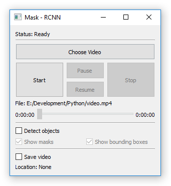
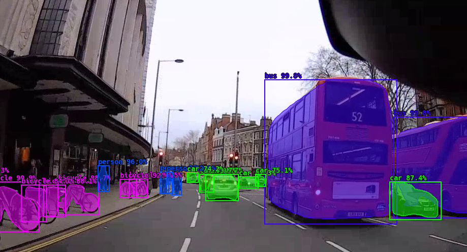
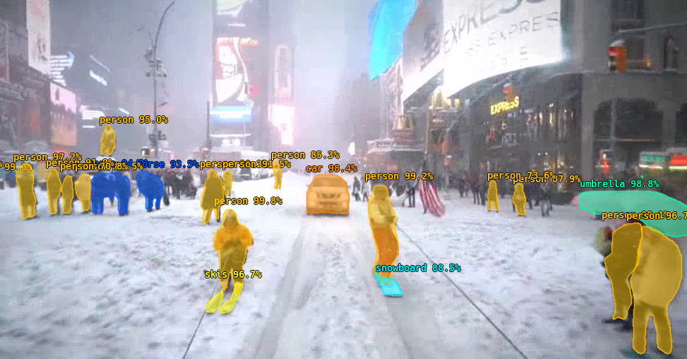

# mask-rcnn-wrapper

This project provides a simple GUI wrapper around the [Mask R-CNN](https://github.com/matterport/Mask_RCNN) implementation
by [matterport](matterport).

The wrapper provides an interface allowing you to pick a video to apply the model to. It will apply the model
frame by frame while displaying the output and optionally saving the output to a new video file.

While the video is rendering you can enable/disable object detection (and sub options such as the masks and bounding boxes)
in real time allowing you to apply the model to only certain portions of the video at a time.

## Setup

#### Weights

Create a new folder inside the root project directory called `weights`, download the weight file:

1. Go to `https://github.com/matterport/Mask_RCNN/releases`
2. Download `mask_rcnn_coco.h5`
3. Place the file inside the `weights` folder

[Direct download link](https://github.com/matterport/Mask_RCNN/releases/download/v2.0/mask_rcnn_coco.h5).

#### Dependencies

`cv2, pyqt5, numpy, scipy, cython, h5py, Pillow, scikit-image, 
tensorflow-gpu, keras, pycocotools`

To install `pycocotools`:

1. `git clone https://github.com/philferriere/cocoapi.git`
2. `pip install git+https://github.com/philferriere/cocoapi.git#subdirectory=PythonAPI`

`pycocotools` itself requires [Visual C++ 2015 Build Tools](http://landinghub.visualstudio.com/visual-cpp-build-tools).

This project was developed and tested using Python 3.6

## Credits

[matterport](https://github.com/matterport) - Mask R-CNN implementation

[markjay4k](https://github.com/markjay4k) - displaying frames with OpenCV instead of matplotlib